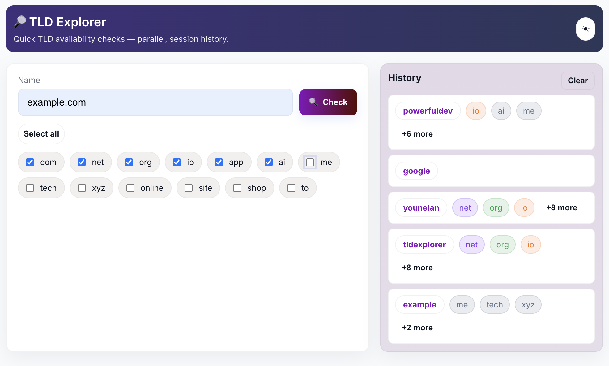

# TLD Explorer

### About
Simple PHP Domain Name checker with history


### Screenshot



### Quick start

Requirements
- PHP 7.4+ with CLI and webserver support
- outbound network access for whois queries (port 43) or a local `whois` binary

Run locally (simple):

Start PHP built-in server from the project root:

```sh
php -S localhost:8000
```

Open http://localhost:8000/ in a browser.

### Notes
- The app uses a small `WhoisService` that queries known whois servers
- edit config.php to modify list of whois Top Level Domains
- History is stored in the PHP session. The frontend saves a summary of available TLDs after each check.

